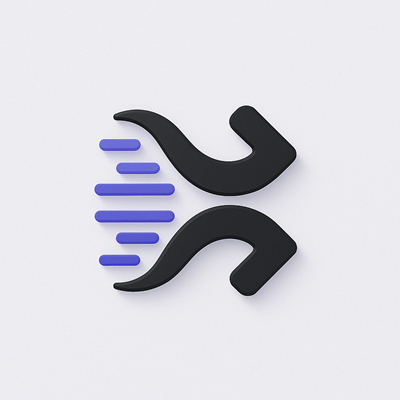
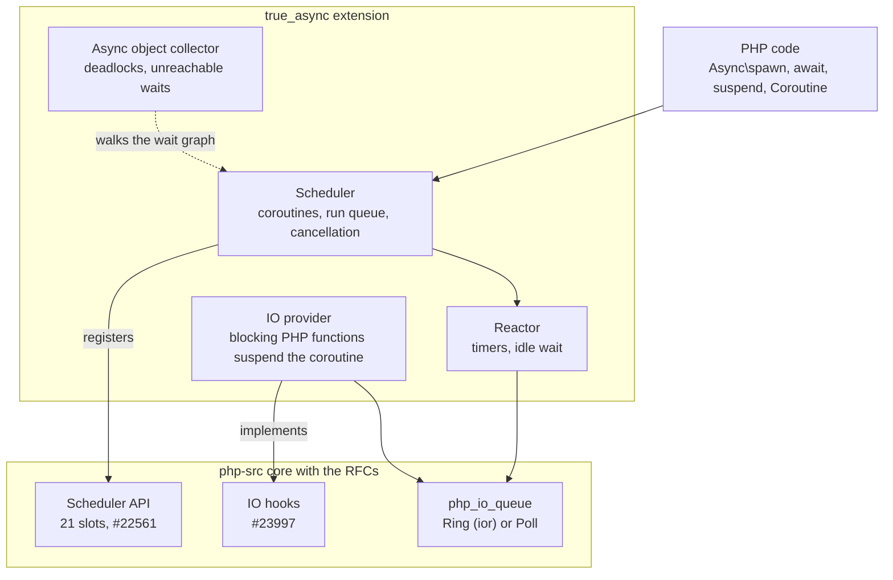

#  True Async

[](https://github.com/true-async/true-async/actions/workflows/ci.yml)
[](LICENSE)


**True Async** is coroutines for PHP as an ordinary PHP extension, the module `true_async`. It
rebuilds [TrueAsync](https://github.com/true-async/php-async) to load into a PHP built from stock
php-src plus the async RFCs, with no php-src patches of its own.

> **Status: early.** The extension builds, loads and is tested in CI on Linux and Windows;
> coroutines come next. The work plan is [`dev/PLAN.md`](dev/PLAN.md).

---

## Table of Contents

- [Goals](#goals)
- [Architecture](#architecture)
- [Roadmap](#roadmap)
- [The core](#the-core)
- [Build](#build)
- [Tests](#tests)
- [Repository layout](#repository-layout)
- [Support the project](#support-the-project)
- [License](#license)

---

## Goals

- **No private core.** Today's TrueAsync needs its own fork of php-src, so it cannot be installed
  into a distribution's PHP or through [PIE](https://github.com/php/pie). True Async uses only the
  public core APIs proposed upstream:
  - the scheduler API, [php/php-src#22561](https://github.com/php/php-src/pull/22561);
  - the IO APIs: IO hooks, the Poll API additions and the Ring,
    [php/php-src#23997](https://github.com/php/php-src/pull/23997).

  A change it needs in the core goes to the RFC as a request, never into a patch shipped here.
- **The TrueAsync API.** The classes, functions and behaviour of TrueAsync are kept: code and tests
  written for it run here. Where an RFC sets a stricter rule, the RFC wins, and the difference is
  recorded in [`dev/DECISIONS.md`](dev/DECISIONS.md).
- **The reactor on the core's IO APIs.** Waiting, timers and IO go through the core's
  `php_io_queue`: the Ring over [ior](https://github.com/libior/ior) where built, the Poll queue
  otherwise. No libuv.
- **Performance.** Spawn, switch, suspend and await are measured against TrueAsync; a change on the
  hot path comes with its numbers.
- **Tests first.** Each stage freezes its list of tests, ported from TrueAsync, before its code.
  Every run goes through debug and ASAN+UBSAN builds, and mutation testing checks that the tests
  catch broken code.
- **Linux and Windows.** Every stage builds and runs its tests on both.

---

## Architecture



---

## Roadmap

<!-- roadmap:begin -->
   

| Stage | Progress | Done |
|---|---|---:|
| ✓ S1 · Core branch `async-core-io` | `██████████` | 100 % |
| ✓ S2 · Repository and test system | `██████████` | 100 % |
| ✓ S3 · Scheduler on the scheduler API | `██████████` | 100 % |
| ✓ S4 · Reactor on Poll, Poll additions and Ring | `██████████` | 100 % |
| ✓ S5 · Futures, timeouts and combinators | `██████████` | 100 % |
| ▶ **S6 · IO hooks provider** | `████████░░` | 80 % |
| ▶ **S7 · Async object collector** | `█████████░` | 86 % |
| S8 · Review checks and RFC change list | `░░░░░░░░░░` | 0 % |
| ▶ **S9 · Higher layers, one at a time** | `████░░░░░░` | 38 % |
| S10 · Beyond the RFCs | `░░░░░░░░░░` | 0 % |

Total: **70 %**, the mean over 10 stages; a stage counts its closed steps in [`dev/PLAN.md`](dev/PLAN.md). Generated by `tools/roadmap.py`.
<!-- roadmap:end -->

---

## The core

Until the RFCs are merged, the core is the php-src branch
[`async-core-io`](https://github.com/true-async/php-src/tree/async-core-io): php-src master with the
two proofs of concept merged, nothing else. [`dev/WORKFLOW.md`](dev/WORKFLOW.md) pins its revision
and gives its configure line.

---

## Build

Linux, against an installed core:

```sh
phpize
./configure --with-php-config=<core prefix>/bin/php-config --enable-true-async
make
php -d extension=modules/true_async.so -d true_async.enable=1 --ri true_async
```

`true_async.enable` (system INI, default `0`) lets a PHP that loads the extension run another
scheduler.

Windows: the repository goes into `ext\true_async` of the core tree and PHP is built with
`--enable-true-async`; [`tools/windows/`](tools/windows/README.md) does it with Debug_TS or Release_TS.

C sources follow `.clang-format` (the php-async configuration plus PHP macro rules):
`tools/format.sh` rewrites them, `tools/format.sh --check` is what CI runs.

---

## Tests

```sh
TRUE_ASYNC_CORE_SRC=<core checkout> tools/test.py --lane pocs-dbg   # pocs-asan, pocs-dbg-cov
tools/check-lists.py --reference <php-async checkout>
tools/mull.py --known-answer
```

| Lane | Build |
|---|---|
| `pocs-dbg` | ZTS debug core, ZendMM on |
| `pocs-asan` | ZTS debug core with ASAN + UBSAN, `USE_ZEND_ALLOC=0` |
| `pocs-dbg-cov` | the debug lane with gcov; line coverage of `src/` |
| `pocs-dbg-mull` | clang 18 with Mull, for mutation testing (`tools/mull.py`) |
| `pocs-win` | Windows, the extension built inside the core tree |

The test lists, the lanes and the CI are described in [`dev/plans/S2.md`](dev/plans/S2.md).

---

## Repository layout

```
config.m4, config.w32, php_true_async.h   build and module entry
src/                                      extension sources
tests/                                    tests by group; tests/lists/ holds the frozen lists
tools/                                    runner, list checker, mutation and CI scripts
dev/                                      plan, principles, decisions, workflow
```

---

## Support the project

If you find TrueAsync useful, you can support its development:

[Donate via Giveth](https://giveth.io/project/trueasync-php)

---

## License

BSD-3-Clause, see [`LICENSE`](LICENSE).
